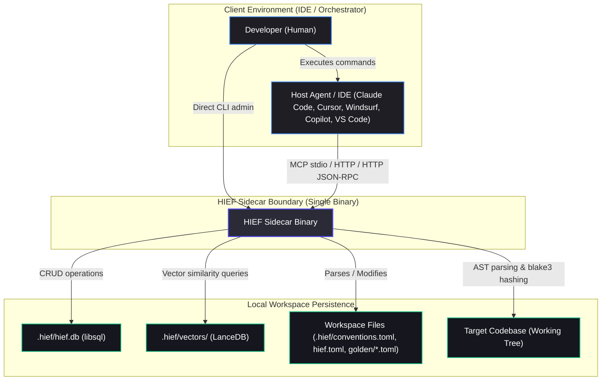
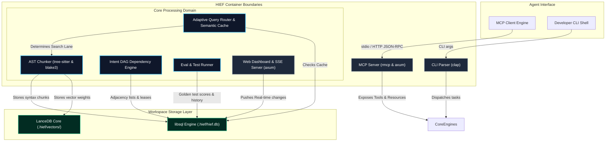
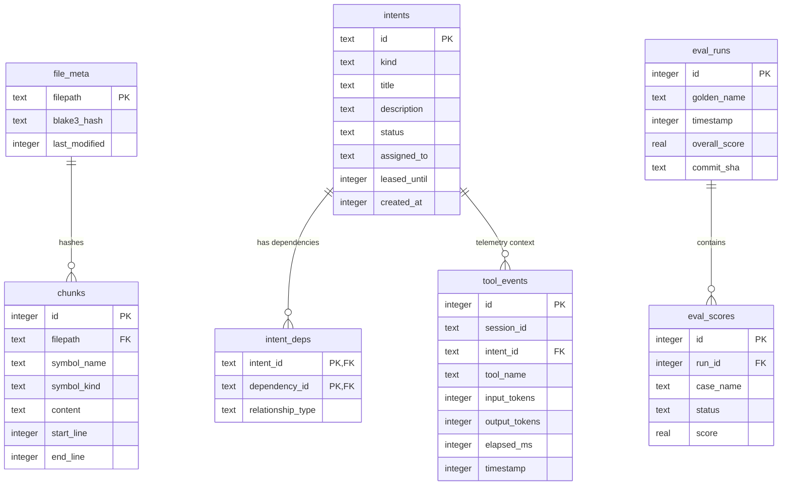
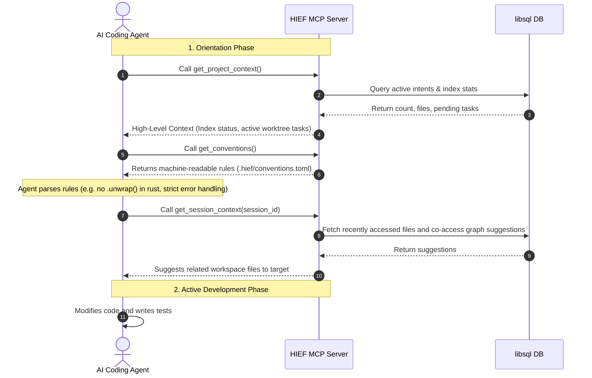
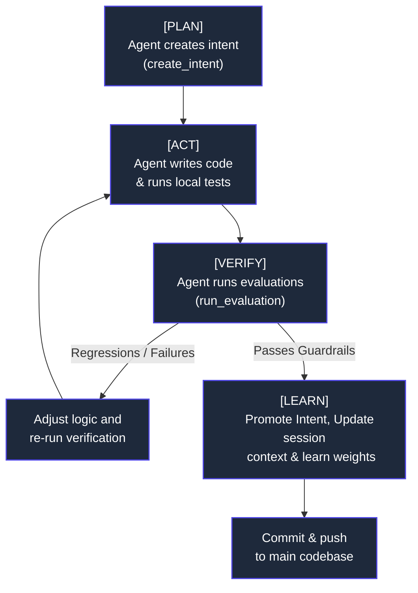

# C4 System Architecture Specification: HIEF (Hybrid Intent-Evaluation Framework)

> **Document Status:** ACTIVE  
> **Target Standards:** C4 Software Architecture Model (Levels 1 & 2) | IEEE 1471 / ISO/IEC 42010  
> **Key Focus:** Sidecar persistent memory, AST context retrieval, multi-agent task DAGs, fail-closed golden-set evals.

---

## 1. Document Control & Executive Summary

HIEF is a **local-first sidecar and Model Context Protocol (MCP) server** that addresses the three core systemic issues of modern AI-assisted engineering: **stateless memory decay**, **context window exhaustion**, and **unverified code regression**. 

HIEF standardizes how local or remote AI agents interact with local workspaces by providing three highly optimized, standard-compliant capabilities:
1. **Incremental AST-Aware Search Index**: A robust retrieval engine combining exact keyword (SQLite FTS5), structural AST pattern-matching (ast-grep), and semantic similarity (LanceDB vector embeddings).
2. **DAG-Based Intent Graph**: A lightweight task coordination schema that manages soft file leases, concurrent worktree boundaries, and actor provenance to avoid multi-agent merge conflicts.
3. **Automated Quality Guardrails (Eval)**: A golden-set regression detector enforcing fail-closed status transitions, SQL-native telemetry, and drift validation to ensure all agent code is pre-vetted.

---

## 2. Competitive Landscape

HIEF is designed specifically to run locally, offering a comprehensive, open-source MCP sidecar that combines retrieval, intents, and quality gates:

| Capability | HIEF | Augment Code | Sourcegraph | Beads | Cursor |
|------------|------|-------------|-------------|-------|--------|
| **Local-first (no cloud)** | ✅ | ❌ | ❌ | ✅ | Partial |
| **MCP server (works with any agent)** | ✅ | ❌ | ❌ | ✅ | ❌ |
| **Quality evaluation** | ✅ | ❌ | ❌ | ❌ | ❌ |
| **Open source** | ✅ | ❌ | Partial | ✅ | ❌ |
| **Task coordination** | ✅ | ❌ | ❌ | ✅ | ❌ |
| **AST-aware structural search** | ✅ | ✅ | ✅ | ❌ | ✅ |

---

## 3. C4 Model - Level 1: System Context

The System Context Diagram defines HIEF's boundaries and standard interaction channels. As a sidecar, HIEF implements a **Zero-Trust, Local-First philosophy**: it has no local LLM reasoning capabilities, never communicates with an external cloud service, and stores all code representations locally.



### System Context Key Interfaces
- **MCP Client Link**: Agents communicate over Model Context Protocol using either standard input/output (stdio) streams or streamable HTTP channels.
- **Relational Backend**: Standard workspace configurations, file hashes, and intent graphs are stored locally inside a lightweight `libsql` SQLite DB instance.
- **Vector Backend**: Deep code semantics are matched via `LanceDB`, executing serverless Approximate Nearest Neighbor (ANN) matches over the workspace.

---

## 4. C4 Model - Level 2: Container Architecture

HIEF is compiled into a single Rust binary to facilitate immediate installation and zero system-dependency overhead. Internally, the sidecar is composed of highly decoupled modular containers communicating through safe, structured interfaces.



### Description of Containers

#### 1. CLI Parser ([cli/](file:///Users/hp/MyCode/rust/hief/src/cli))
Built with `clap` in Rust. Provides direct human and script access to all core capabilities: `hief init`, `hief index build`, `hief graph ready`, `hief eval run --ci`, and `hief serve`. It converts arguments into structured typed commands.

#### 2. MCP Server ([mcp/](file:///Users/hp/MyCode/rust/hief/src/mcp))
Exposes HIEF's tool suite and proactive resources. Incorporates strict parameter validation, path traversal rejection, and error maps implementing standard `std::error::Error`.
- **Tools**: `search_code`, `structural_search`, `semantic_search`, `get_session_context`, `create_intent`, `run_evaluation`.
- **Resources**: `project://overview`, `project://conventions`, `project://health`.

#### 3. Adaptive Query Router & Semantic Cache ([router/](file:///Users/hp/MyCode/rust/hief/src/router))
Intercepts retrieval requests to optimize model context density and reduce token costs.
- **Adaptive Query Lanes**: Dynamically routes keyword, semantic, and structural searches.
- **Response Budgeting**: Truncates oversized results while preserving essential structural metadata.
- **Semantic Caching**: Maintains a TTL-bounded cache in `libsql` for repeated vector searches to prevent CPU waste.

#### 4. AST Chunker ([index/](file:///Users/hp/MyCode/rust/hief/src/index))
Builds and maintains the codebase index.
- Uses `tree-sitter` grammars (Rust, Python, TS/JS) to parse source code into logical AST-aware chunks (matching function and class boundaries rather than arbitrary line sizes).
- Incremental updates are governed by `blake3` cryptographic hashes; only files with modified content are parsed.

#### 5. Intent DAG Dependency Engine ([graph/](file:///Users/hp/MyCode/rust/hief/src/graph))
Validates multi-agent tasks, tracking priority and relationships (`depends_on`, `implements`, `tests`).
- Implements **soft locks** (leases) on specific working tree scopes to detect concurrent work conflicts before code is written.
- Incorporates cycle detection to prevent deadlocks in task execution.

#### 6. Eval & Test Runner ([eval/](file:///Users/hp/MyCode/rust/hief/src/eval))
Executes the verification framework.
- Parses TOML-defined golden sets under `golden/`.
- Conducts substring exact matches (`must_contain`), structural checks (`structural_must_not_contain` via `ast-grep`), and differential checks (`diff_only = true`).
- Enforces fail-closed rules: prevents intent status promotion if regressions are detected.

---

## 5. Key Architectural Decisions (ADRs) & Trade-offs

### ADR 01: Zero-LLM Local-First Sidecar Architecture
- **Decision**: HIEF has **no** direct access to external LLM providers or host keys. It acts as an offline, deterministic database.
- **Rationale**: Keeps execution speeds at sub-millisecond ranges, eliminates operational cloud costs, guarantees 100% data privacy for closed source repos, and avoids coupling the platform to any single model.
- **Trade-off**: The host agent must implement its own reasoning. HIEF does not "write" code; it strictly guides the agent via contextual retrieval and validation structures.

### ADR 02: tree-sitter AST-Aware Chunking vs. Naive Splitting
- **Decision**: Code is chunked at syntax node boundaries (struct, impl, function, class definitions) rather than fixed token or character limits.
- **Rationale**: LLM agents parse code much better when whole functions are presented. AST-aware chunking prevents truncating code blocks in the middle of a control flow block.
- **Trade-off**: Requires pre-compiling specific tree-sitter grammars into the Rust binary, increasing binary size and requiring explicit parser version pinning.

### ADR 03: Unified Relational Persistence via libsql
- **Decision**: Use `libsql` (an embedded SQLite fork running in WAL mode) for all relational data, indexing, and structural queries.
- **Rationale**: Eliminates standard client-server DB operational overhead (Docker, user setup). Supports lightning-fast local SQLite queries. SQLite WAL mode provides clean concurrent multi-agent read-write locks.
- **Trade-off**: Database schema migration logic must be handled internally inside the binary ([db.rs](file:///Users/hp/MyCode/rust/hief/src/db.rs)), requiring strict backward compatibility patterns.

---

## 6. Persistence & Data Schemas (C4 Level 3 Highlights)

All relational data is centralized in `.hief/hief.db`. Below are the core schemas that define HIEF's persistent capabilities.



- **Semantic Vector Storage**: LanceDB stores high-dimensional embeddings (e.g., generated by host agent embedding APIs) locally inside `.hief/vectors/`.
- **System Conventions**: Machine-readable conventions are declared in `.hief/conventions.toml`, which is auto-loaded as an MCP resource (`project://conventions`), turning your rules into machine-verifiable instructions.

---

## 7. Process Flow Specifications (Dynamic Views)

### 7.1 The Session Orientation Protocol (SOP)
When an agent connects to the HIEF MCP server, it must execute a series of orientation handshakes to safely register itself and adapt its behavior to workspace invariants.



### 7.2 Closed-Loop Plan-Act-Verify-Learn (PAVL) Loop
Unlike passive indexers, HIEF implements a closed-loop **PAVL** process that active agents use to continuously improve structural quality, optimize search parameters, and verify code blocks before proposing git modifications.



---

## 8. Failure Mode Effects Analysis (FMEA) & Resiliency

| Threat / Failure | Detection Mechanism | Platform Mitigation Strategy |
| :--- | :--- | :--- |
| **Index Staleness** | Modified files mismatch `file_meta` hashes | Auto-triggers indexing on git hooks (`hief hooks install`) or runs `hief index build` in shadow thread. |
| **Intent Sprawl / Clutter** | Active intent count in `libsql` exceeds maximum allowed threshold | Server enforces auto-archival for intents inactive for $> 7$ days; MCP caps maximum result output lists. |
| **Eval False Positives** | Golden set flags legitimate architectural patterns | Platform supports explicit TOML overrides and manual sign-offs with provenance logging in `tool_events`. |
| **SQLite DB Corruption** | Read-write queries throw hard SQLITE_CORRUPT errors | `hief doctor --fix` wipes the `.hief/hief.db` file and performs a complete incremental rebuild directly from the workspace. |
| **Context Window Waste / Token Pressure** | Response sizes exceed standard client token limits | Integrated response budgeting automatically truncates large blocks, substituting structural JSON signatures. |
| **Concurrency Collisions** | Multiple agents modify overlapping files | Hard soft-lock (lease) system: checks `leased_until` timestamps on target intents before granting `in_progress` status. |

---

## 9. CLI Usage Guide & Verification Runbook

### 8.1 Initialize and Build the Workspace
To spin up a new HIEF context, execute the initialization commands locally:

```sh
# Step 1: Initialize HIEF configuration templates and local DB
hief init

# Step 2: Build the AST-aware code search index (incremental parsing)
hief index build

# Step 3: Start the local task coordination and visualization dashboard
hief ui
```

### 8.2 Starting the MCP Server in the Host Agent
Integrate HIEF with Claude Desktop or cursor by appending the following runtime config:

```json
{
  "mcpServers": {
    "hief": {
      "command": "hief",
      "args": ["serve"]
    }
  }
}
```

### 8.3 Quality Assurance Verification Command
Before shipping modifications or completing a phase, verify that no regressions have been introduced against the golden sets:

```sh
# Execute evaluations in strict CI mode (exits with code 1 if thresholds regress)
hief eval run --ci
```

---

*For detailed specifications, see the [Agent Interaction Protocol](file:///Users/hp/MyCode/rust/hief/dev-docs/agent-protocol.md) and the [Project Constitution](file:///Users/hp/MyCode/rust/hief/docs/specs/constitution.md).*

---
